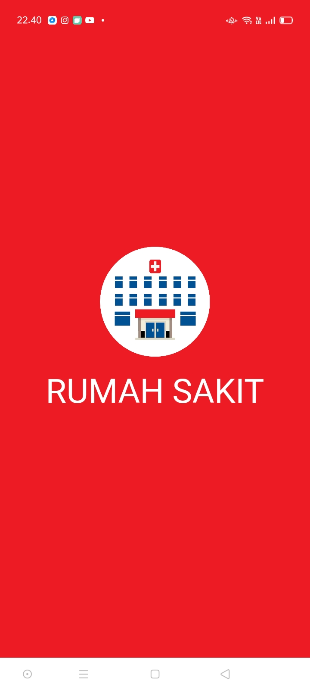
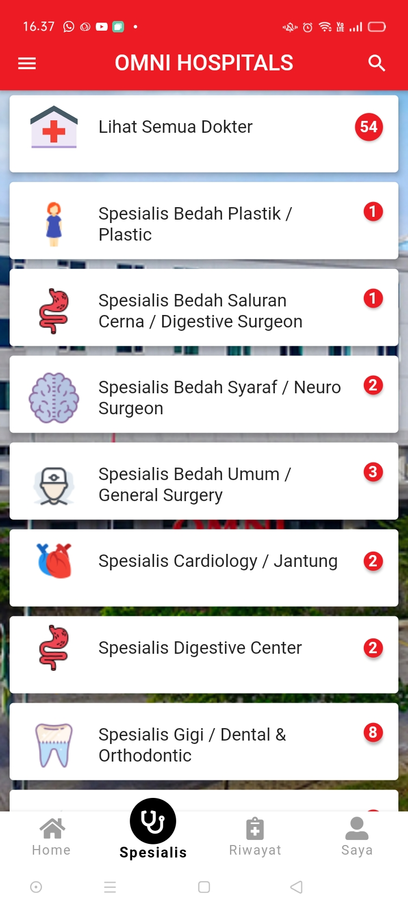
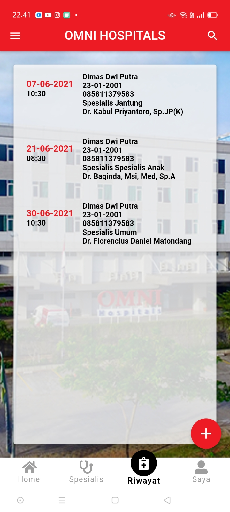
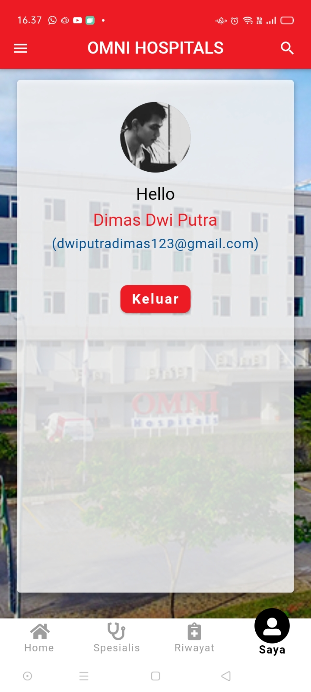
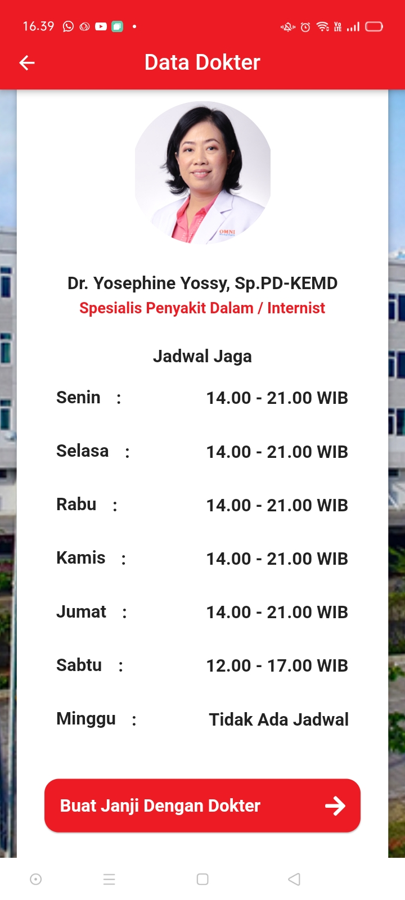
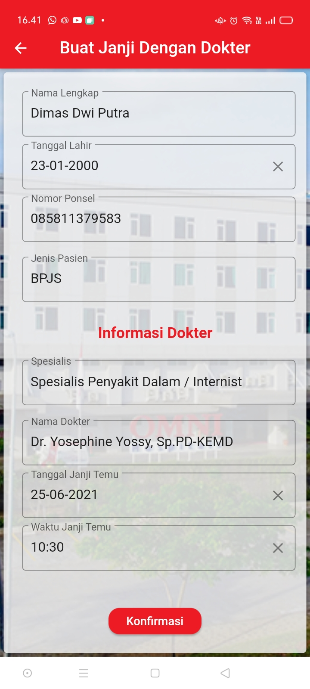
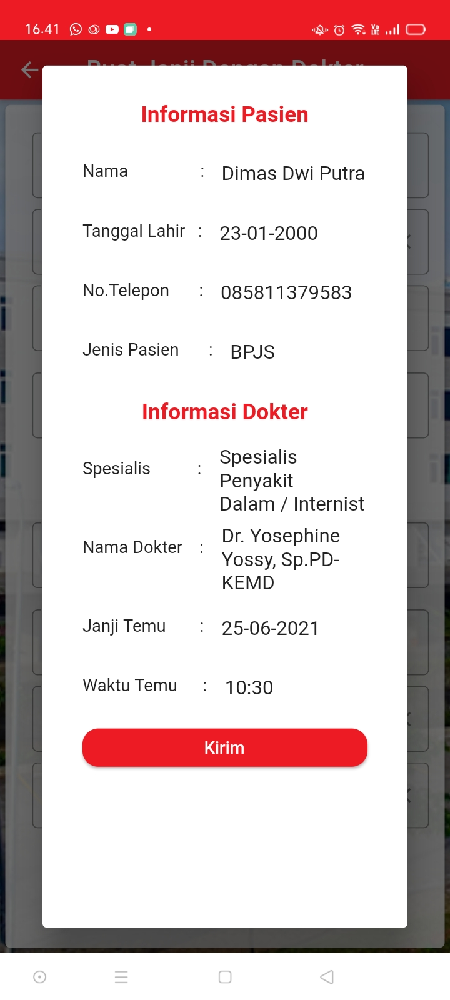

# Aplikasi_Pendaftaran_Pasien

Aplikasi pendaftaran pasien di rumah sakit berbasis android dengan flutter dan firebase

Pada aplikasi ini saya mengambil contoh rumah sakit Omni Hospital

## Developer
[Dimas Dwi Putra](https://github.com/Dimas263/)

- Contact Me Via [Whatsapp](https://wa.me/+6285811379583)
- I'm a Student of Information Technology at [University of Gunadarma](https://www.gunadarma.ac.id)

## Aplikasi

## Tampilan Aplikasi

.

## Download Aplikasi
[Download Aplikasi Pendaftaran Pasien](https://github.com/Dimas263/aplikasi_pendaftaran_pasien/blob/master/rumahsakit.apk)

## Flutter

Aplikasi ini saya buat dengan menggunakan Flutter

- [How to make android and ios application with Flutter](https://flutter.dev/docs/get-started/codelab)
- [Example of Flutter project](https://flutter.dev/docs/cookbook)
- [Online documentation](https://flutter.dev/docs)
