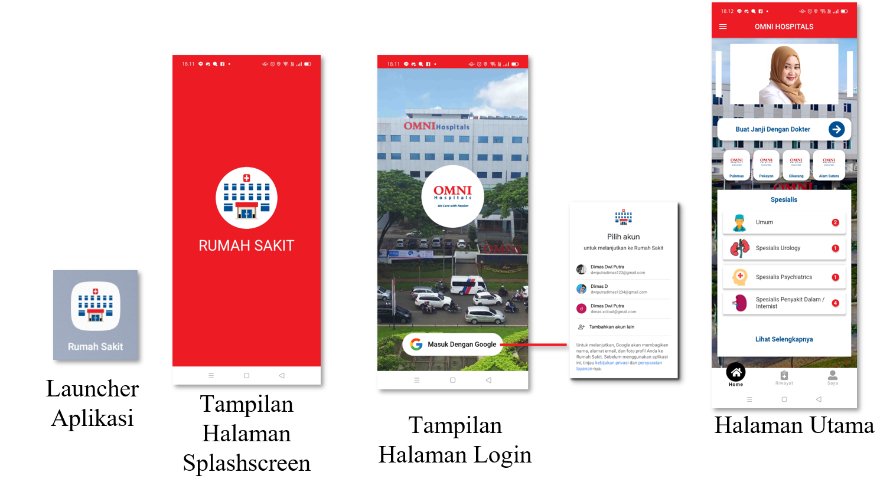
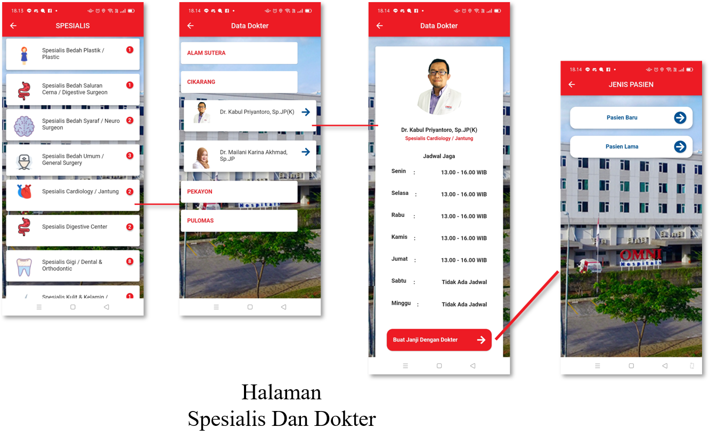
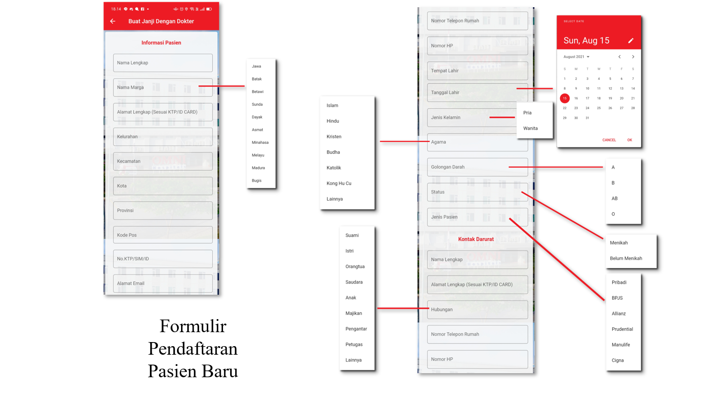
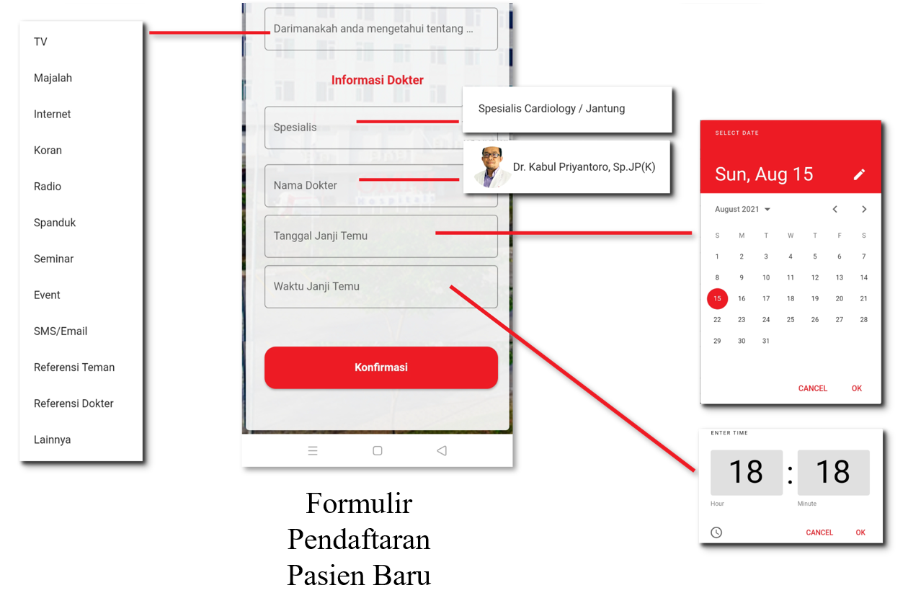
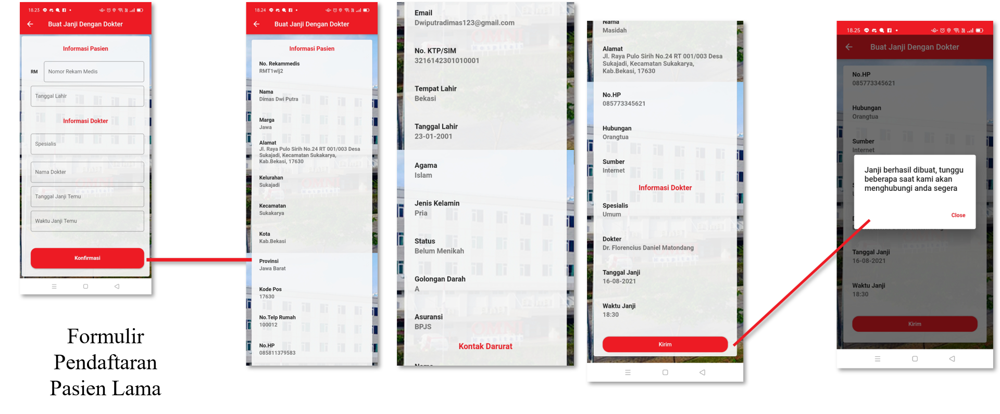
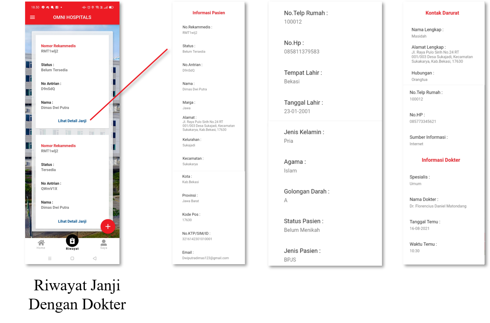
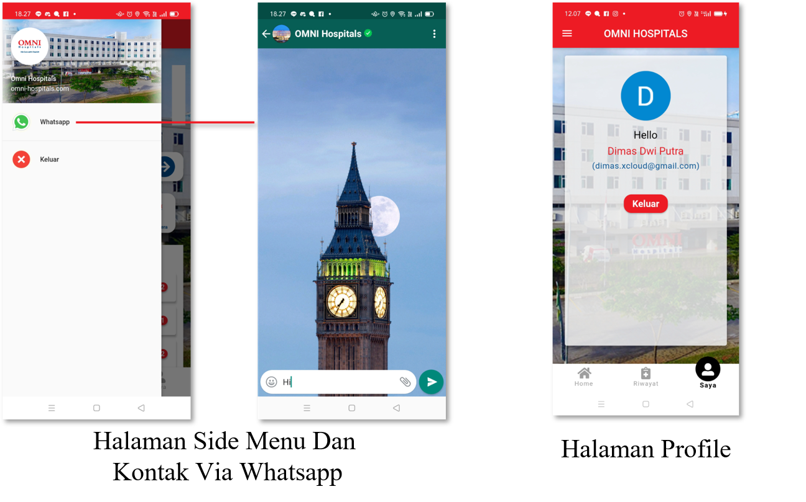
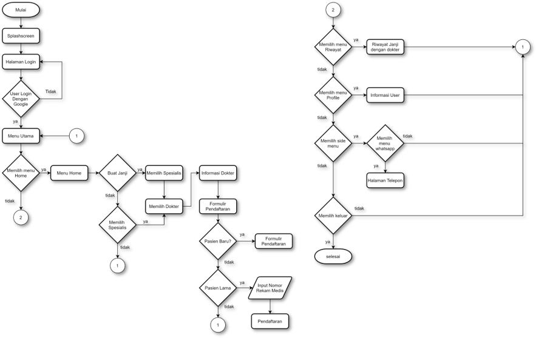

#  Aplikasi_Pendaftaran_Pasien

Aplikasi pendaftaran pasien di rumah sakit berbasis android dengan flutter dan firebase

Pada aplikasi ini saya mengambil contoh rumah sakit Omni Hospital

##  Developer
[Dimas Dwi Putra](https://github.com/Dimas263/)

##  Tampilan Aplikasi

.

<!--
##  Tampilan Pendaftaran Pasien Baru

.

##  Tampilan Pendaftaran Pasien Lama

##  Menu Riwayat

##  Side Menu dan Profil

##  Flowchart

##  Form Pendaftaran
.

-->

##  Download Aplikasi
[Download Aplikasi Pendaftaran Pasien](https://github.com/Dimas263/aplikasi_pendaftaran_pasien/blob/master/rumahsakit.apk)

 
# License
MIT License

Copyright (c) 2021 Dimas Dwi Putra

Permission is hereby granted, free of charge, to any person obtaining a copy

of this software and associated documentation files (the "Software"), to deal

in the Software without restriction, including without limitation the rights

to use, copy, modify, merge, publish, distribute, sublicense, and/or sell

copies of the Software, and to permit persons to whom the Software is

furnished to do so, subject to the following conditions:

The above copyright notice and this permission notice shall be included in all

copies or substantial portions of the Software.

THE SOFTWARE IS PROVIDED "AS IS", WITHOUT WARRANTY OF ANY KIND, EXPRESS OR

IMPLIED, INCLUDING BUT NOT LIMITED TO THE WARRANTIES OF MERCHANTABILITY,

FITNESS FOR A PARTICULAR PURPOSE AND NONINFRINGEMENT. IN NO EVENT SHALL THE

AUTHORS OR COPYRIGHT HOLDERS BE LIABLE FOR ANY CLAIM, DAMAGES OR OTHER

LIABILITY, WHETHER IN AN ACTION OF CONTRACT, TORT OR OTHERWISE, ARISING FROM,

OUT OF OR IN CONNECTION WITH THE SOFTWARE OR THE USE OR OTHER DEALINGS IN THE

SOFTWARE.
