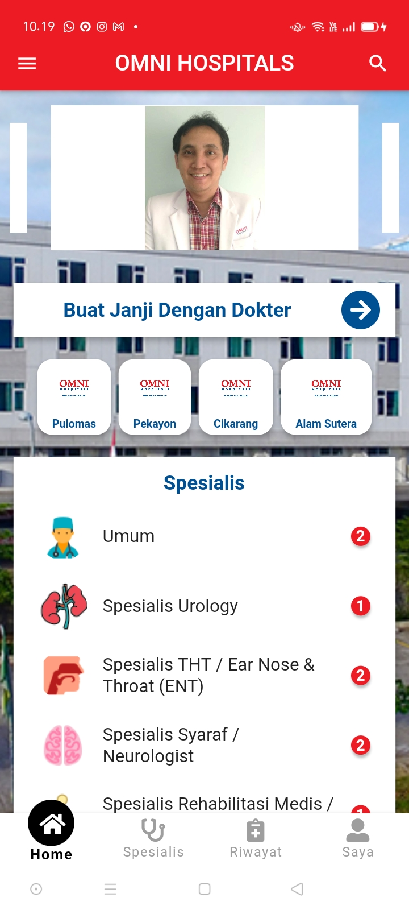
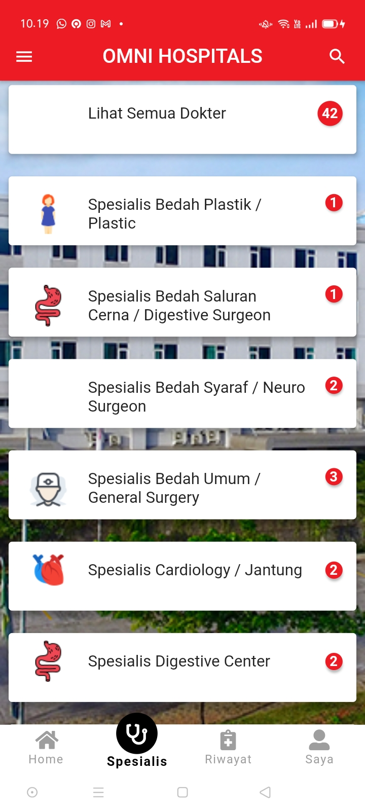
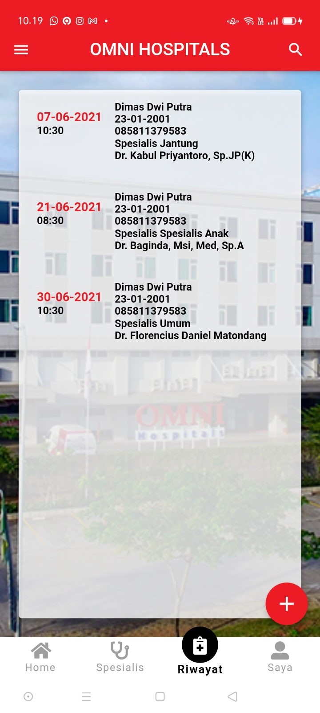
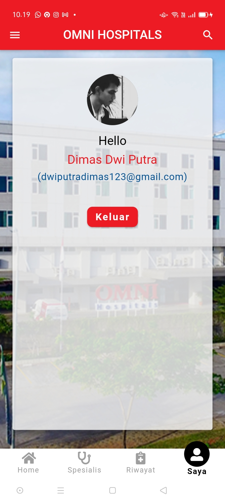

# aplikasi_pendaftaran_pasien

Aplikasi pendaftaran pasien di rumah sakit berbasis android dengan flutter dan firebase

Pada aplikasi ini saya mengambil contoh rumah sakit Omni Hospital

# Aplikasi

# Tampilan Aplikasi

Berikut ini adalah tampilan awal aplikasi

## informasi tambahan

Aplikasi ini saya buat dengan menggunakan Flutter

Kunjungi link dibawah ini untuk belajar bagaimana cara menggunakan flutter

- [Lab: Pelajari cara membuat aplikasi Flutter](https://flutter.dev/docs/get-started/codelab)
- [Cookbook: Pelajari contoh project Flutter](https://flutter.dev/docs/cookbook)
- [online documentation](https://flutter.dev/docs)
